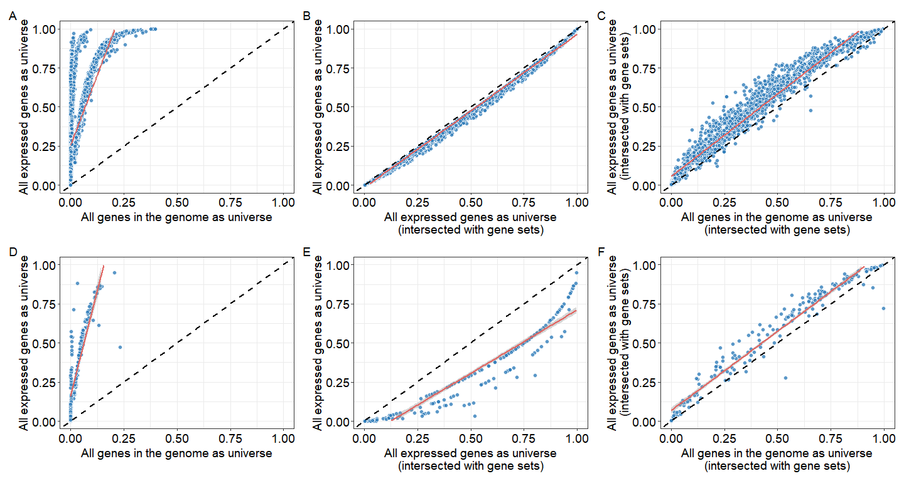

# Background bias in functional enrichment analysis: Insights from clusterProfiler

If you use this work in published research, please cite:

__G Yu__<sup>\*</sup>. [Background bias in functional enrichment analysis: Insights from clusterProfiler](https://doi.org/10.59717/j.xinn-life.2025.100181). __*The Innovation Life*__. 2026, 4(1):100181. 

This repo contains source code to produce **Figure 1** of the above paper.


## Load packages and example data

``` r
library(ggplot2)
library(clusterProfiler)
library(org.Hs.eg.db)

allgenes <- keys(org.Hs.eg.db)
data(geneList, package="DOSE")
de <- names(geneList)[1:200]
```

## Functional enrichment analysis

``` r
options(enrichment_force_universe=TRUE)
bp_allgene <- enrichGO(de, OrgDb = 'org.Hs.eg.db', ont="BP", universe=allgenes)
bp_bg1 <- enrichGO(de, OrgDb = 'org.Hs.eg.db', ont="BP", universe = names(geneList))

bp_allgene_kegg <- enrichKEGG(de, universe=allgenes)
bp_bg1_kegg <- enrichKEGG(de, universe = names(geneList))

options(enrichment_force_universe=FALSE)
bp_allgene2 <- enrichGO(de, OrgDb = 'org.Hs.eg.db', ont="BP", universe=allgenes)
bp_bg2 <- enrichGO(de, OrgDb = 'org.Hs.eg.db', ont="BP", universe = names(geneList))
bp_allgene2_kegg <- enrichKEGG(de, universe = allgenes)
bp_bg2_kegg <- enrichKEGG(de, universe = names(geneList))
```

## Visualization

``` r
cols <- enrichplot:::get_enrichplot_color()

myplot <- function(res1, res2) {
    x <- merge(res1@result, res2@result, by="ID")
    ggplot(x, aes(pvalue.x, pvalue.y)) + 
        geom_point(shape=21, fill=cols[2], size=2.5, alpha=.8, stroke=.02, color='white') + 
        geom_smooth(method='lm', color=cols[1]) +
        geom_abline(slope=1, intercept=0, linetype='dashed', linewidth=1) +
        xlim(0, 1) + ylim(0, 1) + 
        DOSE::theme_dose()
}

p1 <- myplot(bp_allgene, bp_bg1) + 
    xlab('All genes in the genome as universe') +
    ylab("All expressed genes as universe")

p2 <- myplot(bp_bg2, bp_bg1) +
    xlab("All expressed genes as universe\n(intersected with gene sets)") +
    ylab("All expressed genes as universe")

p3 <- myplot(bp_allgene2, bp_bg2) + 
    xlab('All genes in the genome as universe\n(intersected with gene sets)') +
    ylab("All expressed genes as universe\n(intersected with gene sets)")

p4 <- myplot(bp_allgene_kegg, bp_bg1_kegg) + 
    xlab('All genes in the genome as universe') +
    ylab("All expressed genes as universe")

p5 <- myplot(bp_bg2_kegg, bp_bg1_kegg) +
    xlab("All expressed genes as universe\n(intersected with gene sets)") +
    ylab("All expressed genes as universe")

p6 <- myplot(bp_allgene2_kegg, bp_bg2_kegg) + 
    xlab('All genes in the genome as universe\n(intersected with gene sets)') +
    ylab("All expressed genes as universe\n(intersected with gene sets)")

aplot::plot_list(p1, p2, p3, p4, p5, p6, ncol=3, tag_levels='A')
```

<!-- -->
